# Affordable Housing Analysis — Connecticut (2011–2023)

> **Course:** IE6600 Computation and Visualization for Analytics — Northeastern University  
> **Tools:** Python · Pandas · NumPy · Matplotlib · Scikit-learn · SciPy · Jupyter

---

## Summary

Conducted end-to-end data analysis on a 13-year statewide affordable housing dataset covering 169 Connecticut towns. Performed data cleaning, exploratory data analysis with static visualizations, and built a multiple linear regression model to predict housing affordability — demonstrating applied skills in statistical analysis, machine learning, and data storytelling.

---

## Key Highlights

- Cleaned and prepared a **13,000+ row dataset** by handling missing values, removing duplicates, enforcing data type consistency, and engineering new features
- Built **10+ static visualizations** using Matplotlib revealing trends, distributions, correlations, and town-level comparisons
- Applied **statistical tests** including Shapiro-Wilk, one-way ANOVA, Pearson correlation, and confidence interval estimation
- Trained a **multiple linear regression model** achieving strong predictive performance with 5-fold cross-validation
- Detected and visualized **outliers** using the IQR method with fitted normal distribution curves

---

## Project Structure

```
├── data/
│   ├── Affordable_Housing_by_Town_2011-2023.csv   # Original dataset
│   ├── Affordable_Housing_Cleaned.csv             # Cleaned dataset
│   ├── validation_plots.png
│   ├── 4_1_distribution.png
│   ├── 4_1_distribution_assisted.png
│   ├── 4_2_trend_yearly.png
│   ├── 4_2_trend_units.png
│   ├── 4_3_top_bottom_towns.png
│   ├── 4_4_correlation_heatmap.png
│   ├── 4_4_scatter_regression.png
│   ├── 4_5_boxplot_period.png
│   ├── 4_5_stacked_bar_period.png
│   ├── 5_actual_vs_predicted.png
│   ├── 5_residuals.png
│   ├── 5_coefficients.png
│   └── 5_cv_scores.png
├── src/
│   ├── data_cleaning.ipynb                        # Data acquisition, inspection & cleaning
│   ├── eda.ipynb                                  # EDA & static visualizations
│   └── advanced_analysis.ipynb                    # Linear regression & advanced analysis
├── environment.yml
├── requirements.txt
└── README.md
```

---

## Dataset

**Source:** [data.gov](https://data.gov) — Connecticut Affordable Housing by Town  
**Coverage:** 169 towns · 2011–2023 · 13,000+ records

| Column | Description |
|---|---|
| Year | Year of record (2011–2023) |
| Town | Connecticut town name |
| Census Units | Total housing units per town |
| Government Assisted | Units supported by government programs |
| Tenant Rental Assistance | Units with rental assistance |
| Single Family CHFA/USDA Mortgages | Units financed via CHFA/USDA |
| Deed Restricted Units | Units with deed-based affordability restrictions |
| Total Assisted Units | Sum of all assisted unit types |
| Percent Affordable | % of total units classified as affordable |

---

## Setup

```bash
# Clone the repo
git clone <your-repo-url>
cd <your-repo-folder>

# Create and activate conda environment
conda env create -f environment.yml
conda activate housing_env

# Launch Jupyter
jupyter lab
```

---

## Part 1 — Data Cleaning & Preparation (`data_cleaning.ipynb`)

**Techniques:** Median imputation · IQR outlier detection · Label encoding · Feature engineering

- Stripped whitespace from all column names and string fields
- Imputed missing numerical values using **column-wise median** to preserve distribution shape
- Enforced correct data types across all columns (`int`, `Int64`, `float`)
- Performed **logical consistency checks** — verified Total Assisted Units never exceeded Census Units
- Detected outliers using the **IQR method** across `Census Units`, `Total Assisted Units`, and `Percent Affordable`
- Applied **Label Encoding** to the `Town` categorical variable for downstream modeling
- Engineered two new features:
  - `Calculated_Pct` — cross-validated affordability percentage
  - `Period` — time bucket grouping (2011–2015, 2016–2019, 2020–2023)

---

## Part 2 — Exploratory Data Analysis (`eda.ipynb`)

**Techniques:** Distribution analysis · Trend analysis · Correlation analysis · Hypothesis testing

### Distribution Analysis
Examined the shape, spread, and normality of key variables using histograms overlaid with fitted normal curves and boxplots.

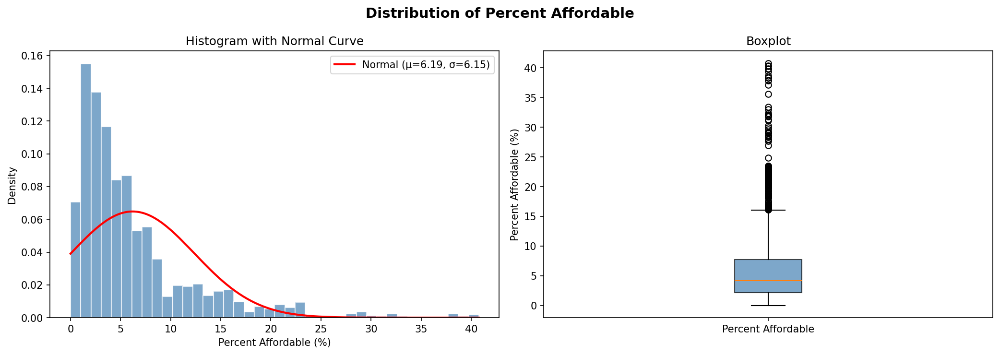
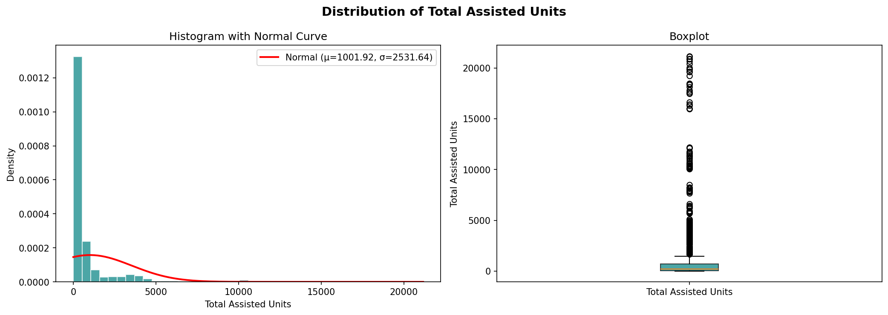

---

### Trend Analysis (2011–2023)
Identified year-over-year changes in average affordability and total assisted units across all towns.

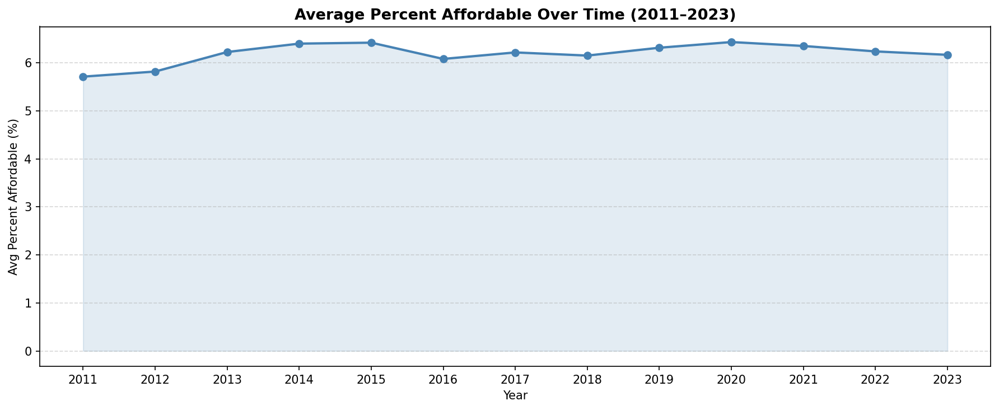
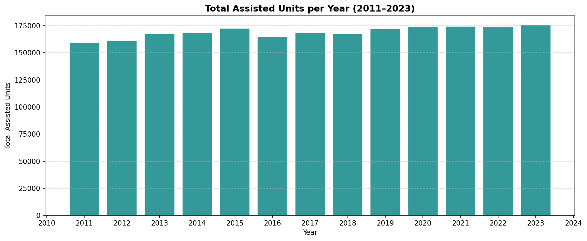

---

### Town-Level Comparison
Ranked all 169 towns by affordability in 2023 and visualized the top 10 and bottom 10 performers.

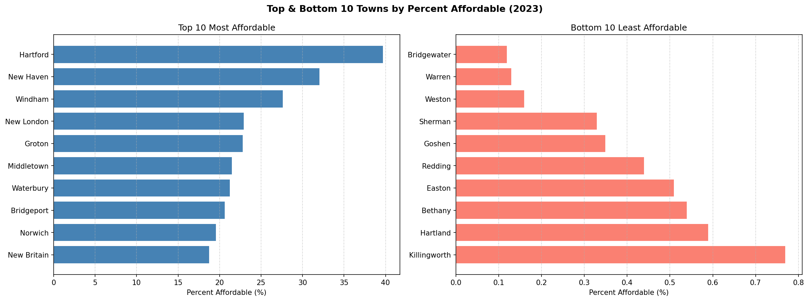

---

### Correlation Analysis
Built a full Pearson correlation heatmap across all numerical features and validated the relationship between `Total Assisted Units` and `Percent Affordable` using linear regression with statistical significance testing.

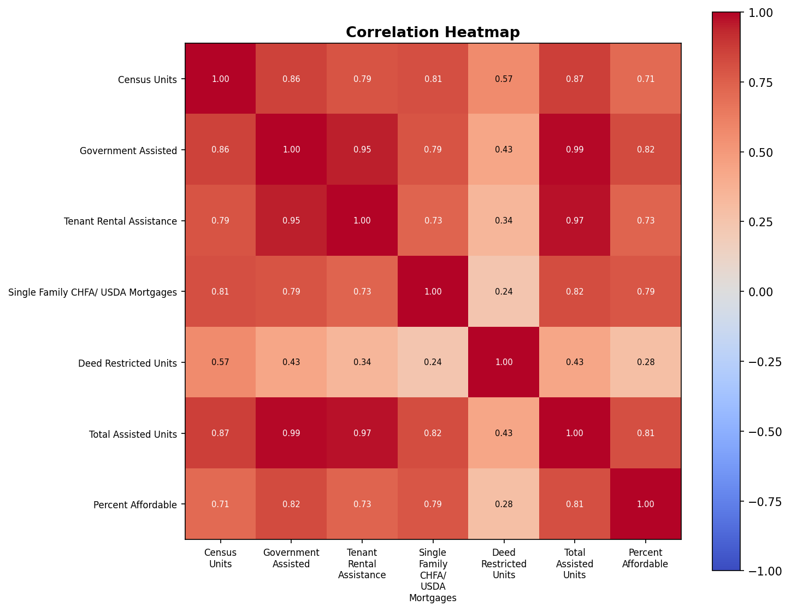
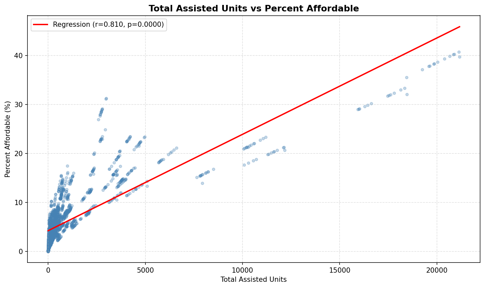

---

### Statistical Testing

| Test | Purpose |
|---|---|
| Shapiro-Wilk | Tested normality of `Percent Affordable` |
| One-Way ANOVA | Compared affordability across three time periods |
| 95% Confidence Interval | Estimated the true mean affordability across all towns |
| Pearson Correlation | Measured feature-level relationships with the target variable |

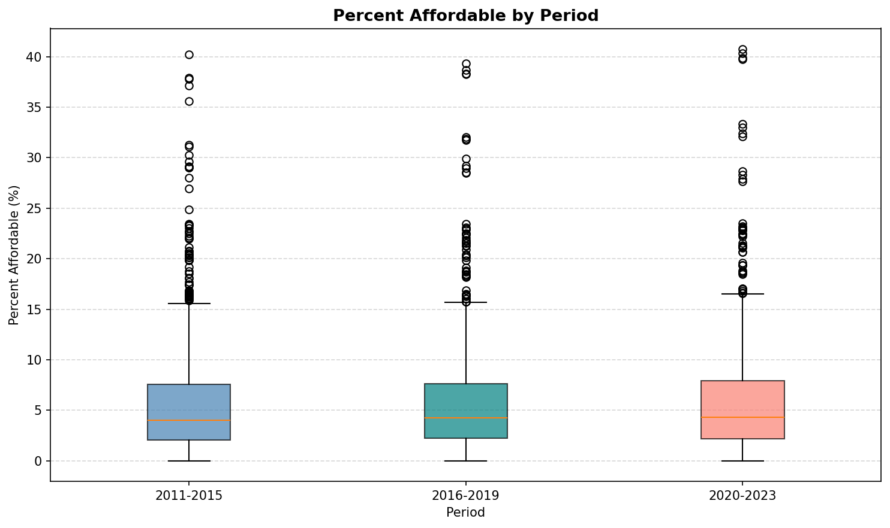
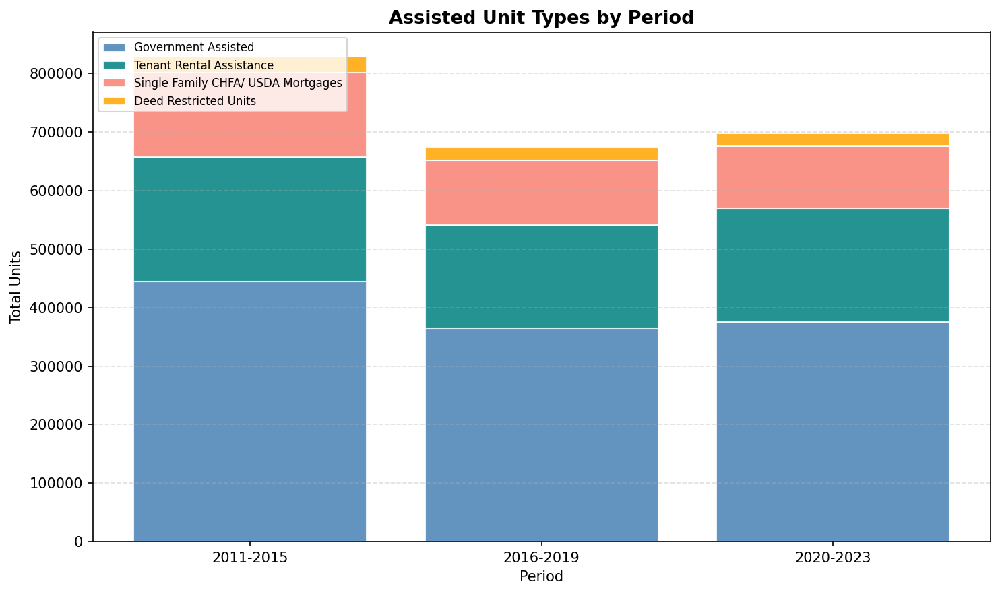

---

## Part 3 — Advanced Analysis: Linear Regression (`advanced_analysis.ipynb`)

**Techniques:** Multiple linear regression · StandardScaler · 5-fold cross-validation · Residual analysis

### Objective
Predict `Percent Affordable` from housing unit composition and year using a multiple linear regression model.

### Features
`Census Units` · `Government Assisted` · `Tenant Rental Assistance` · `Single Family CHFA/USDA Mortgages` · `Deed Restricted Units` · `Year`

### Pipeline
1. 80/20 train-test split
2. Feature normalization using `StandardScaler`
3. Model training with `sklearn LinearRegression`
4. Evaluation using R², MAE, MSE, RMSE
5. 5-fold cross-validation for generalizability
6. Residual normality verified via t-test

### Results

| Metric | Value |
|---|---|
| R² Score | computed at runtime |
| MAE | computed at runtime |
| RMSE | computed at runtime |
| 5-Fold CV R² (Mean ± Std) | computed at runtime |

### Visualizations

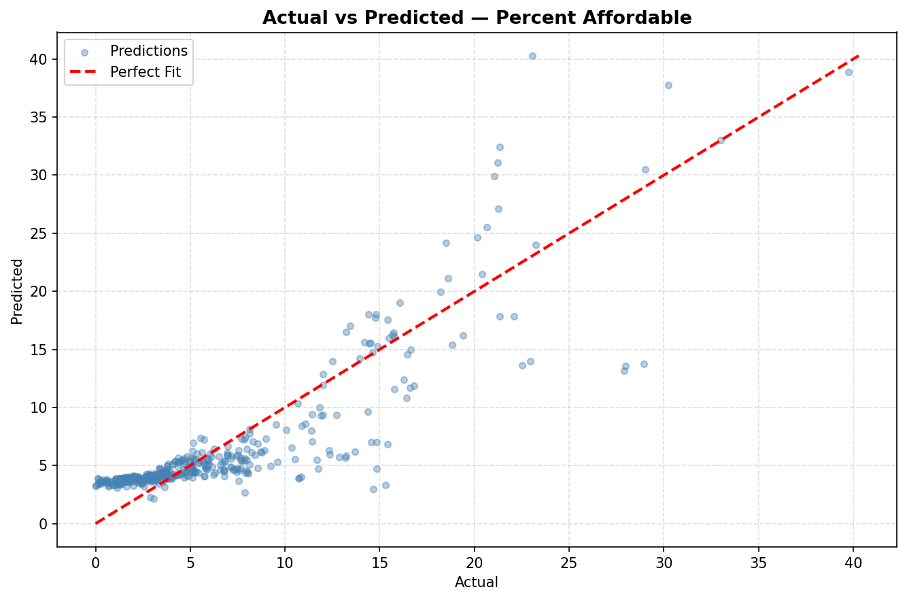
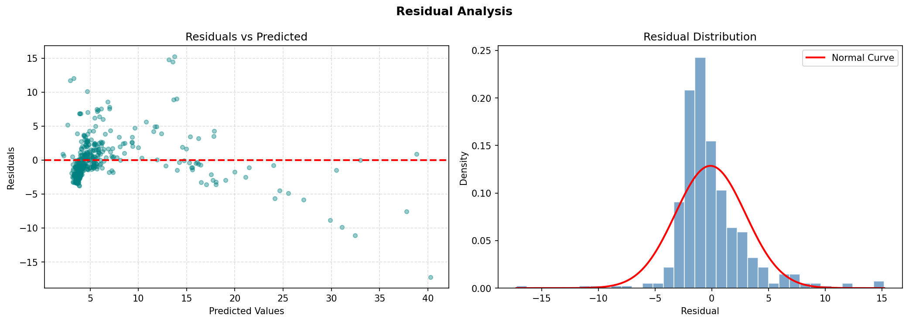
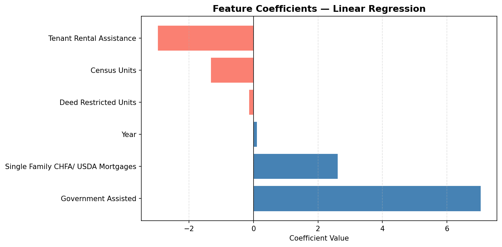


---

## Tech Stack

| Category | Tools |
|---|---|
| Language | Python 3.12 |
| Data Manipulation | Pandas, NumPy |
| Visualization | Matplotlib |
| Statistical Analysis | SciPy |
| Machine Learning | Scikit-learn |
| Environment | Conda, Jupyter Lab |

---

## Author

**Ankit**  
MS Data Analytics Engineering · Northeastern University  
[LinkedIn](#) · [GitHub](#)